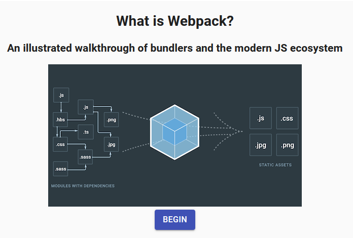

# what-is-webpack
### A walkthrough of front end fundamentals, and how we got to now.

This was a presentation used for a lunch and learn introduction to the modern front end development ecosystem, targeted to non-front end developers and new developers that may have stepped into a world of React, Angular, Webpack, and SASS loaders, with little context for the road that led to this point (as I did a few years ago). I intended this to be the guide I wish I'd had day 1, before I starting abusing AngularJS `$scope` and SPAs that didn't use proper routing, requiring 3 clicks to get to a page each time you refreshed (I swear I've improved on this.)

Much of it is oversimplified, and this could have been a 100 hour talk to cover everything appropriately, but I think it leaves the reader with a number of avenues to explore depending on which paths grabbed their attention
